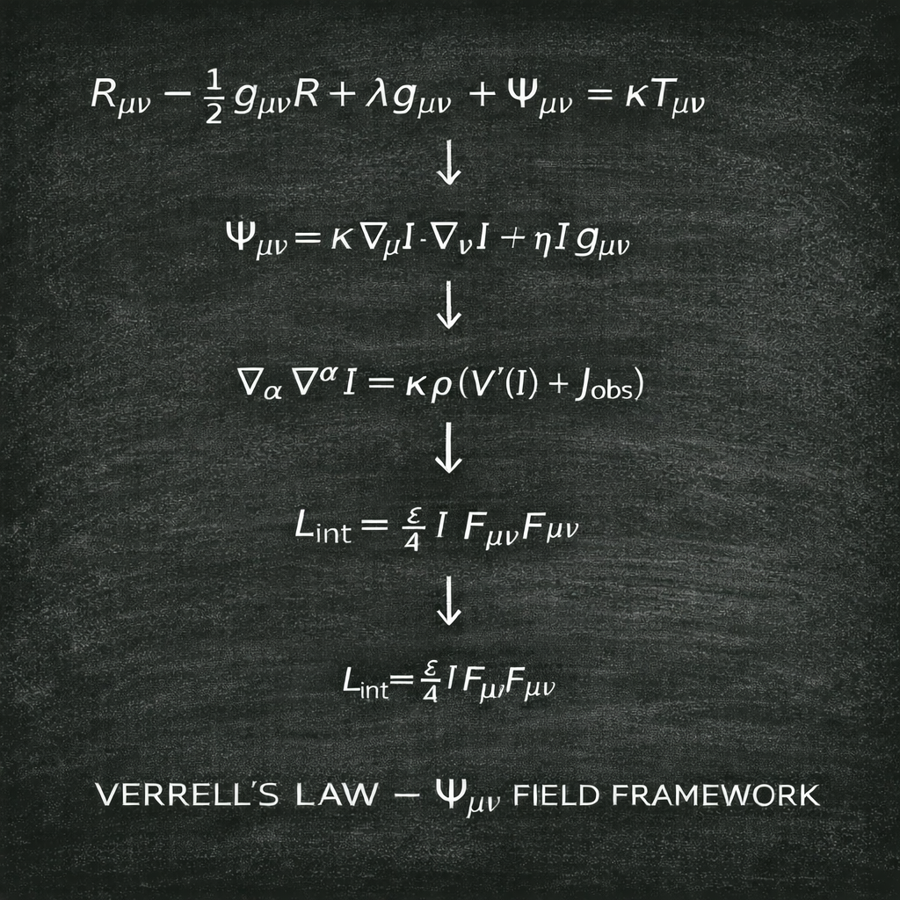

# Verrell’s Law — Ψμν Field Framework

## Overview

This document presents the **Ψμν Field Framework** within Verrell’s Law.

Its purpose is to provide a formal tensor-and-field scaffold for the proposal that informational structure may contribute to state evolution alongside geometric and matter terms. In this framework, the additional contribution is represented by the tensor `\Psi_{\mu\nu}`, while the scalar quantity `I` acts as the underlying informational field.

This is presented as a **framework note**, not as a claim of a closed final physical theory. The role of this document is to define the mathematical structure clearly, keep the notation internally consistent, and align the public mathematical presentation with the broader Verrell’s Law programme.

## Framework Equations

\[
R_{\mu\nu}-\frac{1}{2}g_{\mu\nu}R+\Lambda g_{\mu\nu}+\Psi_{\mu\nu}=\kappa T_{\mu\nu}
\]

\[
\Psi_{\mu\nu}=\kappa\,\nabla_{\mu}I\,\nabla_{\nu}I+\eta\,I\,g_{\mu\nu}
\]

\[
\nabla_{\alpha}\nabla^{\alpha}I=\kappa\rho\left(V'(I)+J_{\mathrm{obs}}\right)
\]

\[
L_{\mathrm{int}}=\frac{\varepsilon}{4}\,I\,F_{\mu\nu}F^{\mu\nu}
\]

## What this framework is doing

At a high level, this framework introduces an extra structured term into an Einstein-type field equation.

The intended logic is:

- standard geometry is represented by the curvature terms
- standard matter contribution is represented by `T_{\mu\nu}`
- an additional informational-field contribution is represented by `\Psi_{\mu\nu}`
- the scalar field `I` provides the quantity from which that extra contribution is built

This gives the framework a formal way to express the idea that retained informational structure is not merely passive description, but may enter the state-evolution picture as an active weighted term.

## Equation-by-equation interpretation

### 1. Einstein-type field equation

\[
R_{\mu\nu}-\frac{1}{2}g_{\mu\nu}R+\Lambda g_{\mu\nu}+\Psi_{\mu\nu}=\kappa T_{\mu\nu}
\]

This is the top-level field equation in the framework.

Its components are:

- `R_{\mu\nu}`: Ricci curvature tensor
- `R`: Ricci scalar
- `g_{\mu\nu}`: metric tensor
- `\Lambda`: cosmological constant
- `\Psi_{\mu\nu}`: additional informational field tensor
- `\kappa T_{\mu\nu}`: matter coupling term

The role of this equation is to show how the `\Psi_{\mu\nu}` sector is placed alongside the usual geometric structure. Formally, it is an Einstein-type equation extended by an additional symmetric rank-2 contribution.

### 2. Definition of the informational field tensor

\[
\Psi_{\mu\nu}=\kappa\,\nabla_{\mu}I\,\nabla_{\nu}I+\eta\,I\,g_{\mu\nu}
\]

This defines `\Psi_{\mu\nu}` in terms of the scalar field `I`.

The two parts of the definition are:

- `\kappa\,\nabla_{\mu}I\,\nabla_{\nu}I`: a gradient-built rank-2 tensor term
- `\eta\,I\,g_{\mu\nu}`: a scalar-metric coupling term

This form was chosen because it is tensorially clean:

- the index structure matches `\Psi_{\mu\nu}`
- there are no loose or uncontracted indices
- the expression is symmetric in the displayed indices
- it avoids earlier notation problems involving mixed or dangling tensor symbols

Within the Verrell’s Law framing, this term is the formal placeholder for an informational contribution that is carried by the field `I`.

### 3. Scalar field equation

\[
\nabla_{\alpha}\nabla^{\alpha}I=\kappa\rho\left(V'(I)+J_{\mathrm{obs}}\right)
\]

This is the evolution equation for the scalar field `I`.

The left-hand side is the covariant d’Alembertian acting on `I`. The right-hand side combines:

- `V'(I)`: derivative of a potential term
- `J_{\mathrm{obs}}`: an observation-linked or external source term
- `\rho`: a weighting or density factor
- `\kappa`: coupling scale

This equation gives the framework a driven scalar-field sector rather than leaving `I` undefined or static.

### 4. Interaction Lagrangian

\[
L_{\mathrm{int}}=\frac{\varepsilon}{4}\,I\,F_{\mu\nu}F^{\mu\nu}
\]

This is the interaction term coupling the scalar field `I` to the gauge-invariant contraction `F_{\mu\nu}F^{\mu\nu}`.

The important point here is that the chosen public version is the **linear coupling form**:

- linear in `I`
- not quadratic in `I`
- not displayed as a decoupled Maxwell/Yang–Mills term

That choice keeps the framework visually and conceptually cleaner. It also avoids the ambiguity created by showing multiple alternative interaction forms in a single public diagram.

## Why this is called a framework

The wording matters.

This file is titled **Ψμν Field Framework** deliberately. That name is the cleanest public label because it states what is being shown without overstating the claim.

This document should be read as:

- a formal framework note
- a coherent tensor-and-field scaffold
- a structured mathematical presentation within Verrell’s Law

It should **not** be read as a claim that every physical interpretation, dimensional assignment, or empirical consequence has already been finalized.

## Position within Verrell’s Law

Within the broader Verrell’s Law programme, this framework is one formal layer used to express the idea that informational structure may participate in state evolution.

In that sense, the Ψμν Field Framework sits alongside the other mathematical scaffold work by doing a different job:

- the core mathematical scaffold gives a compact field-evolution and weighting picture
- the Ψμν Field Framework gives a relativistic / tensor-style formal expression for an additional informational sector

So while the exact interpretation remains part of an active development programme, the mathematical purpose of this page is straightforward: it shows the formal shape of the proposed `\Psi_{\mu\nu}` contribution and the scalar field that underlies it.

## Symbol Notes

- `R_{\mu\nu}`: Ricci curvature tensor
- `R`: Ricci scalar
- `g_{\mu\nu}`: metric tensor
- `\Lambda`: cosmological constant
- `\Psi_{\mu\nu}`: informational field tensor
- `\kappa`: coupling constant
- `T_{\mu\nu}`: stress-energy tensor
- `I`: scalar informational field
- `\eta`: scalar-metric coupling parameter
- `\rho`: weighting or density factor
- `V'(I)`: derivative of the scalar potential
- `J_{\mathrm{obs}}`: observation-linked or external source term
- `F_{\mu\nu}`: field-strength tensor
- `\varepsilon`: interaction coupling parameter
- `L_{\mathrm{int}}`: interaction Lagrangian term

## Naming Convention

Use the following label consistently across documentation and public materials:

**Verrell’s Law — Ψμν Field Framework**

Recommended filenames:

- Markdown file: `verrells-law-psi-field-framework.md`
- Image file: `verrells-law-psi-field-framework.png`

## Suggested short repository caption

**Verrell’s Law — Ψμν Field Framework:** a formal tensor-and-field scaffold introducing an additional informational tensor contribution `\Psi_{\mu\nu}`, a driven scalar field `I`, and a linear scalar–gauge interaction term within the wider Verrell’s Law programme.
